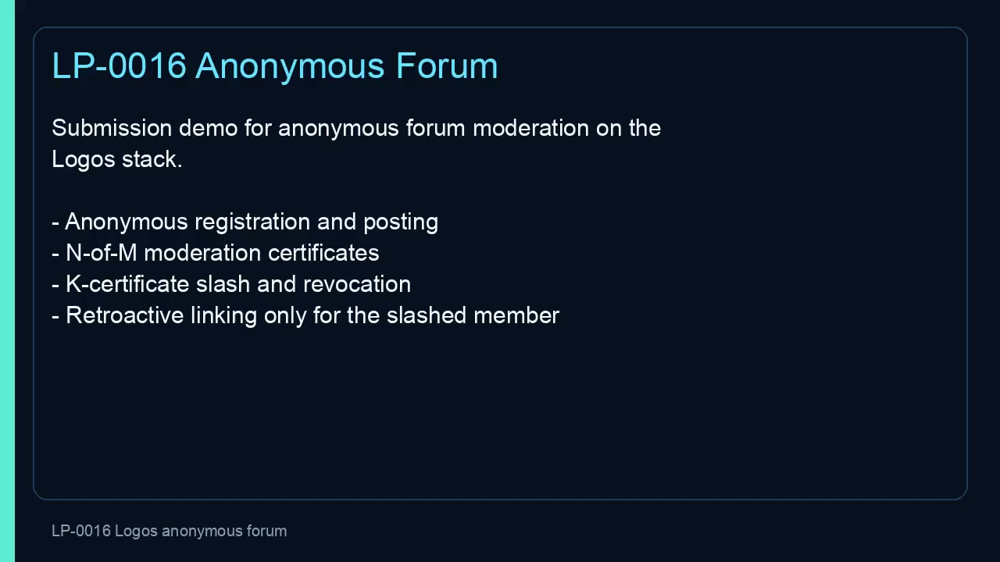

# LP-0016 — Anonymous Forum with Threshold Moderation and Membership Revocation

A complete submission for [LP-0016](https://github.com/logos-co/lambda-prize/blob/master/prizes/LP-0016.md): a forum-agnostic moderation library with K-strike slashing built on the Logos stack, plus a Basecamp app demonstrating the full lifecycle. Posts are anonymous and unlinkable until a member accumulates K moderation certificates; reconstruction then triggers an on-chain slash and retroactive linkability of *only* that member's prior posts.

License: MIT. See `LICENSE`.

## One-command evaluator gate

```bash
git clone <this repo> && cd Logos/src
scripts/local_submission_gate.py
```

Latest run: **17/17 steps pass** — Python lifecycle demo, success-criteria suite, Rust build/tests, RISC0 host feature, real RISC0 proof @ ~5 s with `RISC0_DEV_MODE=0`, LEZ guest check/build, local sequencer deploy, Lean 4 build, Basecamp package. Per-step logs and `evidence.json` land in `src/dist/submission/`.

## What's shipped

| Area | Evidence |
| --- | --- |
| **Production crypto** | Ristretto255 scalar field, Ed25519 moderator signatures, threshold ElGamal with Chaum–Pedersen DLEQ partials, Pedersen-style DKG transcript, sorted Merkle membership/non-membership proofs |
| **RISC0 membership proof** | Real guest binary, real prover with `RISC0_DEV_MODE=0`, measured **5.254 s** on this laptop (target < 10 s). See `src/dist/submission/risc0_proof_performance.json` |
| **LEZ deployment** | `lez-framework` guest at `src/methods/guest/src/bin/lp0016_registry.rs`, built and submitted to the official local sequencer at `localhost:3040`. Image ID `dd914ffd…7ea9` recorded in `src/registry/program_ids/localnet.txt` |
| **Lean 4 proofs** | `sorry`-free build of state-machine invariants, `slash_sound`, certificate-threshold soundness, and the Shamir/Lagrange reconstruction proof contract under `src/lean/AnonymousForum/` |
| **Forum-agnostic SDK** | `moderation-sdk` exposes `ForumSdk` + `OffchainStore` + `RetryQueue` traits; never assumes content shape; namespaced storage and retry queue documented in `src/docs/api.md` |
| **Two independent forums** | `src/scripts/demo_e2e.py` exercises Forum A (K=2, N=2-of-3) and Forum B (K=3, N=1-of-2) end-to-end including slash, revocation, post-after-revocation rejection, and retroactive linkability |
| **Basecamp app** | 9-screen QML flow + Rust C-ABI core-module bridge over `moderation-sdk`. Packaged as `lp0016-anon-forum-demo.lgx` via `src/scripts/package_basecamp.sh` |
| **Narrated demo video** | [`submission/lp0016-demo.mp4`](submission/lp0016-demo.mp4) — 1280×720 H.264/AAC, ~2 min, narrated walkthrough of architecture and full lifecycle |
| **Optional Noir circuit** | `src/noir/post_binding/` — additive ACIR/Nargo circuit for the post-binding relation, runnable with `nargo test` |

## Demo Video

[](submission/lp0016-demo.mp4)

Click the first frame to open the narrated MP4 walkthrough.

## Quick verification commands

```bash
cd src
scripts/local_submission_gate.py                                # full gate
python3 scripts/demo_e2e.py                                     # Python lifecycle demo (no deps)
python3 -m unittest scripts/test_protocol.py                    # protocol unit tests
cargo build --workspace                                         # Rust workspace build
cargo test --workspace                                          # Rust test suite (49+ tests)
RISC0_DEV_MODE=0 scripts/demo_e2e.sh                            # real RISC0 host integration
python3 scripts/check_risc0_proof_performance.py --run-prover --fail-on-blocked
python3 scripts/collect_localnet_evidence.py                    # local sequencer deploy + demo
cd lean && lake build                                           # Lean proofs (sorry-free)
```

## Proof-stack overview

- **RISC0** — primary ZK proof path. The membership guest proves registered membership and revocation non-membership against published Merkle roots. The host crate is feature-gated so the default workspace build doesn't need `cargo-risczero`.
- **Lean 4** — mechanically checked protocol invariants: certificate thresholds, slash-bundle shape, revocation activity, and the Shamir/Lagrange reconstruction contract. `Shamir.lean` also includes a concrete dependency-free affine interpolation sanity theorem, while production finite-field interpolation remains in Rust. Cryptographic primitives (hashes, signatures, threshold ElGamal, RISC0 receipts) are stated as assumptions.
- **Noir** — optional ACIR/Nargo circuit covering the anonymous-post binding relation. Documented in `src/docs/noir.md`.

### Lean 4 modules

- `Basic.lean` — abstract forum model: forum parameters `K`/`N`, moderator membership, certificates, slash bundles, registry state, active commitments, revoke transition.
- `Invariants.lean` — core structural invariants: valid certificates meet the `N` threshold, every signer is a moderator, valid slash bundles carry exactly `K` valid certificates, revoked commitments are no longer active.
- `Slash.lean` — `VerifySlash` and `slash_sound`: a verified slash implies the commitment was registered, was not already revoked, and the bundle has exactly `K` certificates; every certificate meets the `N` signer threshold.
- `Shamir.lean` — `ShamirSystem` proof contract for the Lagrange-reconstruction layer plus a concrete affine reconstruction theorem over Lean `Int`; the Rust implementation supplies the production finite-field interpolation behavior. `ShamirTargets.lean` keeps a compatibility theorem name.

## Repository layout

```text
src/crates/protocol-core      Pure protocol state machine: field, Shamir, certs, slash, threshold ElGamal, Merkle
src/crates/moderation-sdk     Forum-agnostic SDK facade and storage abstraction
src/crates/registry-sim       Local registry simulation binary (emits JSON consumed by slash-verifier)
src/crates/slash-verifier     CLI + library for slash-bundle verification
src/crates/risc0-statement    Pure RISC0 guest statement (CPU-tested, links into the guest)
src/registry/lp0016-registry  LEZ/SPEL registry crate
src/methods/guest             Deployable lez-framework RISC0 guest
src/zk/membership-host        Feature-gated RISC0 host integration
src/zk/membership-guest       Feature-gated RISC0 guest
src/app/basecamp-forum        Basecamp QML flow + Rust core-module bridge
src/lean/AnonymousForum       Lean 4 proof modules (sorry-free)
src/noir/post_binding         Optional Noir post-binding circuit
src/scripts                   Demos, success-criteria tests, runtime diagnostics, submission gate
src/docs                      protocol.md, api.md, threat-model.md, performance.md, submission.md
submission                    Narrated demo video and submission README
```

## Submission artifacts

- Local gate report: `src/dist/submission/evidence.json`
- Localnet deploy + RISC0 evidence: `src/dist/submission/localnet_evidence.json`
- RISC0 proof performance: `src/dist/submission/risc0_proof_performance.json`
- Localnet registry image ID: `src/registry/program_ids/localnet.txt`
- Narrated demo video: [`submission/lp0016-demo.mp4`](submission/lp0016-demo.mp4)
- Demo video poster: [`submission/lp0016-demo-poster.jpg`](submission/lp0016-demo-poster.jpg)
- Video generator: `src/scripts/make_submission_video.py`
- Submission walkthrough doc: `src/docs/submission.md`

GitHub Actions is intentionally not the acceptance gate because hosted jobs are blocked before startup by account billing/spending limits. The local gate is reproducible from a clean clone.

## Remaining external blockers (transparent accounting)

These three items are blocked by external runtimes, not by the protocol or implementation. Each has a structured local diagnostic that reports the exact missing artifact.

1. **CU costs for `register_member` / `slash_member`** — local registry deploy succeeds; the current `logos-scaffold`/`wallet` path exposes no custom-invoke or CU-report command for those instructions. `src/scripts/measure_cu.sh` emits the narrowed JSON blocker.
2. **Public LEZ devnet/testnet program IDs** — the official LEZ wallet quickstart documents standalone local-sequencer usage at `localhost:3040` and does not publish public devnet/testnet RPC URLs. If reviewers accept the official local-sequencer path, `localnet_evidence.json` and `registry/program_ids/localnet.txt` cover deployment; otherwise `src/scripts/check_live_network_deploy.py` reports the env vars and program-ID files still needed.
3. **Basecamp QML inspector click-through in a clean shell** — artifact discovery is durable from `LOGOS_BASECAMP_CACHE`/`~/.cache/logos-basecamp`, and `app/basecamp-forum/ui-tests.mjs` defines the LP-0016 click-through flow. The public `logos-basecamp` v0.1.1 DMG and the current action-built app do not expose the QML inspector endpoint; a locally built inspector-enabled Basecamp app passes click-through. `src/scripts/check_basecamp_inspector.py` reports the narrowed blocker as JSON.

## Further reading

- Protocol specification: `src/docs/protocol.md`
- Implementation spec and engineering decisions: `src/SPEC.md`
- API reference: `src/docs/api.md`
- Threat model: `src/docs/threat-model.md`
- Performance plan and numbers: `src/docs/performance.md`
- Status and history: `STATUS.md`, `REPO.md`

## Related Prize Resources

- [LP-0016 original prize text](HACK.md)
- [Logos Execution Zone repo](https://github.com/logos-blockchain/logos-execution-zone)
- [Semaphore — group membership and ZK proofs](https://semaphore.pse.dev/)
- [Shamir's Secret Sharing — How to Share a Secret](https://cacm.acm.org/research/how-to-share-a-secret/)
- [Threshold decryption overview — Boneh and Shoup, A Graduate Course in Applied Cryptography](https://crypto.stanford.edu/~dabo/cryptobook/BonehShoup_0_6.pdf)
- [LP-0001 — Private NFT Ownership Proof](https://github.com/logos-co/lambda-prize/blob/master/prizes/LP-0001.md)
- [LP-0003 — Private Allowlist / Airdrop Distributor](https://github.com/logos-co/lambda-prize/blob/master/prizes/LP-0003.md)
